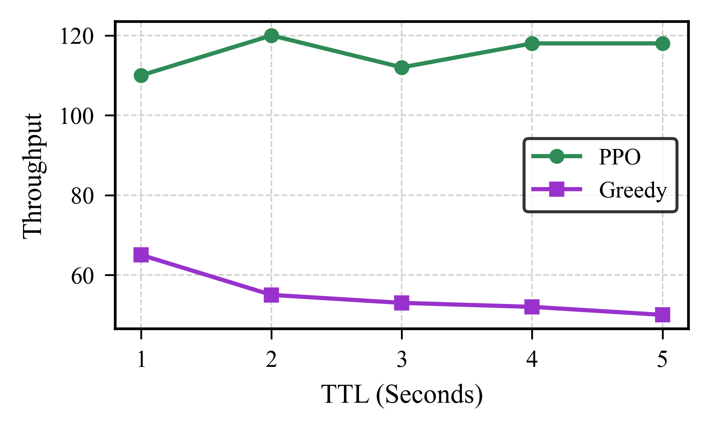
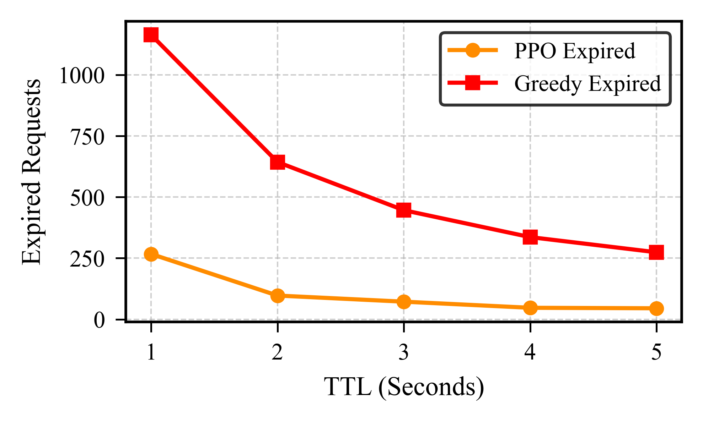

# PPO-Based Entanglement Scheduler for LEO Satellite Quantum Networks

---

## Overview

This repository contains the full implementation of the framework presented in:

> **"Optimal Solution for Entalgment Rate and Fidelity Maximization under Requests Expiration Constraint for Free-Space Quantum Networks"**
> Muhammad Tauseef Mushtaq, Vito Guida, Nicola Cordeschi
> Department of Electrical and Information Engineering, Politecnico di Bari

We address the problem of entanglement request scheduling in Low Earth Orbit
(LEO) satellite quantum networks using a physics-grounded Markov Decision
Process (MDP) solved by Proximal Policy Optimization (PPO) with dynamic
action masking. The environment integrates a complete physical-layer model —
free-space diffraction, atmospheric attenuation, iterative entanglement
purification, and quantum memory decoherence — running on real Starlink
orbital ephemeris data.

Against a fidelity-greedy deterministic baseline, the trained PPO agent achieves:

- **↑ 84% higher throughput** (served requests per second) at Time-To-Live (TTL) = 1 s
- **↓ 4× fewer expired requests** at TTL = 1 s
- **Stable 110–122 req/s** across all TTL regimes (1 s – 5 s)
- **> 99.9% success rate** and **~94% average fidelity** in all configurations

The Greedy baseline *degrades* as TTL increases (queue-clogging),
while PPO exploits longer coherence windows — demonstrating that
AI-driven scheduling is a necessary complement to hardware improvements
in future quantum network infrastructure.

---

## Mathematical Formulation

### Key Variables

| Symbol | Description |
|---|---|
| $N_{served,t}$ | Requests that completed all 3 entangled pairs at timestep $t$ |
| $N_{total}$ | Total requests in queue (fixed at 3) |
| $F_{avg,t}$ | Average post-purification fidelity of links established at $t$ |
| $N_{expired,t}$ | Requests dropped at $t$ because wait time exceeded TTL |
| $\alpha, \beta, \delta$ | Normalized weights for throughput, fidelity, and expiry penalty |
| $\pi$ | Scheduling policy (satellite selection logic) |
| TTL | Time-To-Live coherence limit (seconds) |

---

### Optimization Problem

The scheduler maximizes cumulative entanglement throughput, quantum link quality, and TTL compliance over an episode $[0, T]$:

$$
\max_{\pi} \sum_{t=0}^{T} \left( \alpha \frac{N_{served,t}(\pi)}{N_{total}} + \beta \cdot F_{avg,t}(\pi) - \delta \cdot N_{expired,t}(\pi) \right)
$$

The term inside the summation is used directly as the **instantaneous reward** $R_t$ in the PPO training loop.

---

### MDP Definition

**State** $S_t \in \mathbb{R}^{59}$: a concatenation of the active request's demand features ($Q_{current}$, 14-dim) and the top-5 satellites ranked by fidelity ($C_t$, 45-dim = 9 features × 5 satellites). Each satellite entry includes elevation angle, slant range, expected fidelity, and a 6-bit LoS coverage mask over the six ground stations.

**Action** $A_t \in \{0,\ldots,5\}$: indices 0–4 select one of the top-5 satellites; index 5 defers the request. A dynamic boolean mask (computed per micro-step) forces probability to zero for any satellite lacking simultaneous LoS or already mutex-locked by a prior request in the same 22 ms macro-step.

**Reward** $R_t$:

$$
R_t = \alpha \left(\frac{N_{served}}{N_{total}}\right) + \beta \cdot F_{avg} - \delta \cdot N_{expired}
$$

The micro-step architecture freezes the physical clock while the three concurrent requests are evaluated sequentially, reducing the action space from $\mathcal{O}(|S|^3)$ to $\mathcal{O}(|S|)$ per macro-step without sacrificing temporal consistency.

---

## Results

### TTL Sensitivity (PPO vs. Greedy)

PPO maintains stable throughput across all TTL regimes while the Greedy baseline degrades as TTL increases due to queue clogging.

*Figure: Throughput comparison across TTL = 1–5 s.*

*Figure: Expired requests comparison across TTL = 1–5 s.*

---

### TTL = 1 s — Detailed Results

All four PPO weight configurations achieve **≥ 99.9% success rate** and **~94% average fidelity**. The Greedy baseline reaches 97.5% success rate and 93.7% average fidelity at the same TTL.

| Agent | $\alpha$ | $\beta$ | $\delta$ | Throughput | Req Generated | Req Served | Expired |
|---|:---:|:---:|:---:|:---:|:---:|:---:|:---:|
| PPO | 0.45 | 0.30 | 0.25 | 93 | 67,875 | 67,491 | 384 |
| PPO | **0.30** | **0.45** | **0.25** | **120** | 86,888 | 86,705 | 183 |
| PPO | 0.45 | 0.25 | 0.30 | 111 | 80,186 | 79,909 | 277 |
| PPO | 0.25 | 0.30 | 0.45 | 114 | 82,645 | 82,420 | 225 |
| **Greedy** | — | — | — | 65 | 46,920 | 45,757 | 1,163 |

> Best PPO configuration (bold) delivers **84% higher throughput** and **6.3× fewer expired requests** than Greedy at TTL = 1 s.
